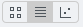

Analyze metadata using OMERO.parade
===================================

**Description:**
----------------

OMERO.parade is a metadata-mining plugin for OMERO.web. It enables
access to the metadata of images in OMERO for plotting, display and
filtering of images. Supported metadata includes number of ROIs,
Key-Value pairs, and data stored in OMERO.tables.

**Setup:**
----------

-  Install the OMERO.parade web app as described at
   https://pypi.org/project/omero-parade/

**Resources:**
--------------

-  Sample images from the Image Data Resource (IDR) `idr0021 <https://idr.openmicroscopy.org/search/?query=Name:idr0021>`__. See `idr0021-data-prep.md <https://github.com/ome/training-scripts/blob/master/maintenance/preparation/idr0021-data-prep.md>`__ for download and import instructions.

-  Sample plate data from Plate with 422 on IDR from `idr0002 <https://idr.openmicroscopy.org/search/?query=Name:idr0002>`__. Use the script `idr_copy_plate.py <https://github.com/ome/training-scripts/blob/master/maintenance/scripts/idr_copy_plate.py>`__ to copy Plate ID 422. Run the script with ``$ python idr_copy_plate.py username password 422 --server your.server.org``

**Step-by-Step:**
-----------------

**Filter Images by Annotations and ROI Count**

1.  Select the Project **idr0021**.

2.  Choose the *Parade* option in the centre panel dropdown menu.

3.  Expand all Datasets by clicking on the *Open All* button.

    * All the Datasets will be expanded in the left-hand tree.

    * The Thumbnails will be loaded in the centre panel. This allows to browse a full Project.

    * Note that if you collapse a Dataset in the tree, the Thumbnails will be removed from the centre panel.

4.  In the *Add filter...* selection box, select the *Key_Value* item.

    * When the Map Annotations are loaded, pick the Key *Gene Symbol* and enter the Value *CEP* to show all *CEP* genes and then *CEP120* to show only images with that gene.

    * To remove this last filter, hover over the filter and click the *X* button that shows on hover.

5.  In the *Add filter...* selection box, select the *ROI_Count* item.

    * Enter a Value *> 20.* When you hover over the area used to enter the value, the range is indicated in the tooltip.

    * Then enter < 3 or 4.

6.  Remove all filters by clicking the X button showing on hover.

7.  Select several images in the Dataset, and in the right-hand pane add
    a comment to them saying “poor staining”. Refresh, using the
    refresh button |image0| above the left-hand pane.

8.  In the *Add filer…* selection box, select the *Comment* item.

    * Enter a text “poor staining”

9.  Note that you can use the selected images in right panel to annotate
    or *Open with...*.

10. For example, *Open with Figure...*

**Analyze OMERO.table data using OMERO.parade**

In case the parameter values on the images are coming from OMERO.tables
(stored in OMERO.tables as numerical values), OMERO.parade also enables
to compare parameters in metadata, using heatmaps ordering and plotting
of the parameters against each other.

For how to create an OMERO.table from a csv file see
https://github.com/ome/omero-metadata/blob/master/README.rst

For how to create an OMERO.table using a script, see workflow (link to
Fiji workflow).

#. Select the Project **idr0021**.

#. Choose the *Parade* option in the centre panel dropdown menu.

#. Expand all Datasets by clicking on the *Open All* button.

#. In the *Add filter...* selection box, select the *Table* item so we
   can find using the analytical results generated previously:.
   Choose the *Bounding_Box* item and drag the slider to filter the
   Images. Note that *PCNT* has the largest number of Images with
   large ROIs.

   |image1|

#.  Switch to Table layout (middle button).\ |image2|

#.  In the selection box *Add table data*\ …, select

    * *Table_Bounding_Box*

    * *Table_Total_Area*

    * *Table_Image*

    * Note that it is currently not possible to remove a column.

#.  Click on the name of a column to sort it.

#.  Uncheck *Show Datasets* to sort all Images together e.g. by ROI count.

    |image3|

#.  Check the checkbox in each column to show the *Heatmap*. Note the
    corresponding pattern in the Heatmap.

#.  Switch now to the Plot Layout (third button).

#.  It takes the first 2 columns of table data loaded and plots the values.

#.  Filters can be added to plot the relevant results.

#.  Try plotting by different Axis values.

#.  Closing a Dataset in the left-hand tree removes the values from the plot.

#.  Drag to select several outliers.

#.  Note that you can use the selected images in right panel to annotate or *Open with...*.

#.  For example, *Open with Figure...*

**Filter Plate Wells using OMERO.table data**

Let’s now look at the results generated by CellProfiler

1. Return to the webclient and select the Plate named **plate1_1_013**.

2. Select a Well and open the *Tables* pane in the General tab in the
   right-hand panel. This will show all the CellProfiler values for
   this Well.

3. In the *Thumbnails* chooser at the top-right of the centre panel,
   select the *Parade* plugin.

4. At the top-left of the centre panel choose *Add filter...* -> *Table*
   to filter Wells by the data from CellProfiler.

5. Change the filter from *ImageNumber* to *Cell_Count* (at the bottom
   of the list).

6. Now you can use a slider to filter Wells by Cell Count.

   |image4|

.. |image3| image:: images/image3.png
   :width: 2.0625in
   :height: 0.35417in

